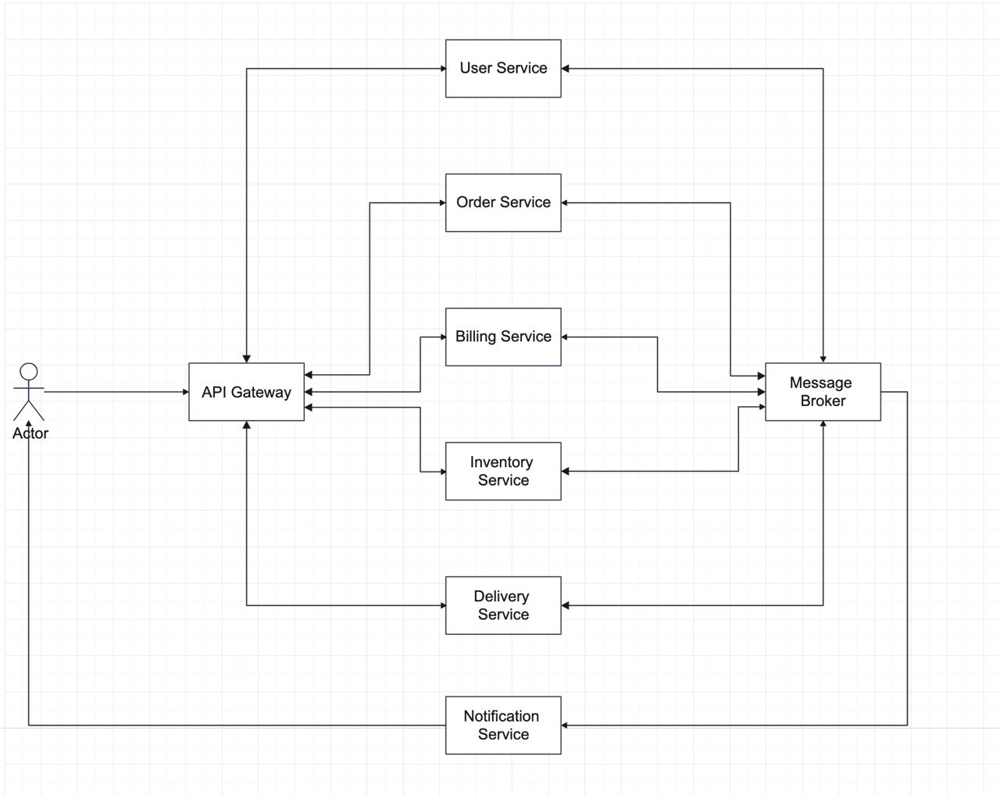

### Пользовательские сценарии
- Просмотр каталога товаров
- Авторизация
- Регистрация
- Оформление заказа
- Оплата заказа
- Доставка заказа

### Схема взаимодействия сервисов

### Назначение сервисов и зоны ответственности
#### User Service
- Регистрация
- Авторизация
- Заполнение/редактирование данных пользователья
#### Order Service
- Создание заказа
- Отмена заказа
#### Billing Service
- Оплата заказа
- Возврат средств за отмененный заказ
#### Inventory Service
- Наполнение/редактирование каталога товаров
#### Delivery Service
- Логика доставки и бронирования курьеров на слот времени доставки
#### Notification Service
- Отправка уведомлений клиенту

### Контракты взаимодействия сервисов друг с другом
Сервисы взаимодейтсвуют друг с другом асинхронно с помощью брокера сообщений

- user.registered.queue - Очередь сообщений с событиями регистрации пользователя
- user.data_edited.queue - Очередь сообзений с событиями об изменении данных пользователья
- order.created.queue - Очередь сообщений с событиями создания заказа
- order.state_changed.queue - Очередь сообщений с событиями изменения статуса заказа
- order.paid.queue - Очередь сообщений с событиями оплаты заказа
- order.refund.queue - Очередь сообщений с событями возврата средств заказа
- products.reserved.queue - Очередь сообщиний с событиями бронирования товаров на складе
- products.backward.queue - Очередь сообщений с возвратом забронированных товаров на склад
- notification.queue - Очередь сообщений для отправки уведомлений клиенту

